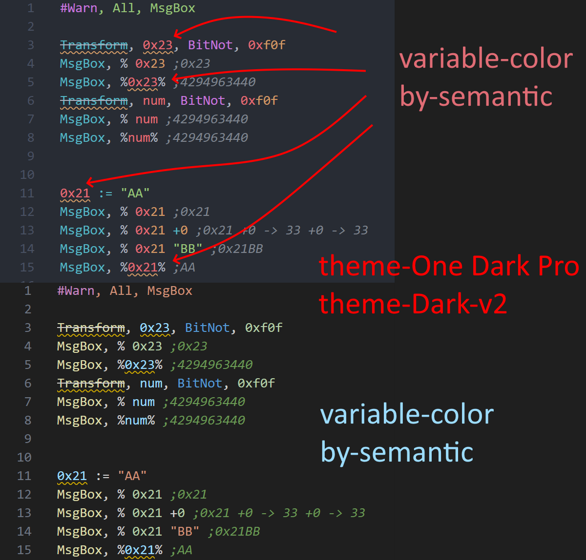

# code507 avoid set `Number` as variable

## Also avoid overwriting command line parameters

> original - <https://www.autohotkey.com/docs/v1/Scripts.htm#cmd_args_old>\
> **Legacy:** The command line parameters are also stored in the [variables](https://www.autohotkey.com/docs/v1/Variables.htm) %1%, %2%, and so on, as in versions prior to [\[v1.1.27\]](https://www.autohotkey.com/docs/v1/AHKL_ChangeLog.htm#v1.1.27.00). In addition, %0% contains the number of parameters passed (0 if none). However, these variables cannot be referenced directly in an expression because they would be seen as numbers rather than variables. The following example exits the script when too few parameters are passed to it:
>
> ```ahk
> if 0 < 3  ; The left side of a non-expression if-statement is always the name of a variable.
> {
>    MsgBox This script requires at least 3 incoming parameters but it only received %0%.
>    ExitApp
> }
> ```
>
> ...skip below

## exp1

Because ahk v1.1, don't warn before running, so I provide this option.

```ahk
#Warn, All, MsgBox

0x001 := "9999"
MsgBox, % 0x001 ; show "0x001"
MsgBox, % 0x001 + 0 ; show 0, Because "0x001" + 0    ->    0 + 0    ->   0

0x001 := 9999
MsgBox, % 0x001 ; "0x001"
MsgBox, % 0x001 + 0 ;

0x001 := "str-str-str"
MsgBox, % 0x001 ; "0x001"
MsgBox, % 0x001 + 0 ;
```

## exp2

some-case is legal, but unreasonable (For the 1 hour I wasted.)

```ahk
#Warn, All, MsgBox

Transform, 0x23, BitNot, 0xf0f
;          ^ show warn message at this, When the code review is tired, this kind of code may be accidentally approved to enter the official code
MsgBox, % 0x23 ;0x23
MsgBox, %0x23% ;4294963440 ;If this is after 2000 lines, this will be a happy trap

Transform, num, BitNot, 0xf0f
MsgBox, % num ;4294963440
MsgBox, %num% ;4294963440


0x21 := "AA" 
;^ show warn message at this,
MsgBox, % 0x21 ;0x21
MsgBox, % 0x21 +0 ;0x21 +0 -> 33 +0 -> 33
MsgBox, % 0x21 "BB" ;0x21BB
MsgBox, %0x21% ;AA
```



## exp3

```ahk
#Warn, All, MsgBox

1 := "AA"
MsgBox, % 1 ;1
MsgBox, % 1 +0 ;1
MsgBox, % 1 "BB" ;1BB
MsgBox, %1% ;AA

20 = "AA"
MsgBox, % 20 ;20
MsgBox, % 20 +0 ;20
MsgBox, % 20 "BB" ;20BB
MsgBox, %20% ;AA
```
